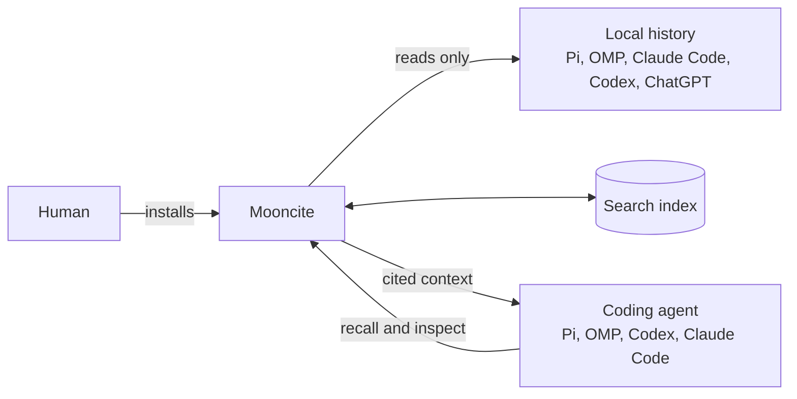

# Mooncite

Mooncite lets coding agents recover past context without asking you to explain it again. It searches authorized Pi, OMP, Claude Code, Codex, and ChatGPT history stored on this machine. Before an agent relies on a result, `mooncite_inspect` checks the citation against the original file. That confirms where the text came from. It does not prove the text is still true.

Mooncite was formerly Claude Memory MCP. The repository keeps its old `claude-memory-mcp` URL.



## Install

Mooncite requires Linux with procfs, Node.js 24 or newer, `npm`, and access to GitHub.

```bash
npx --yes github:WhenMoon-afk/claude-memory-mcp#v4.0.6 install
```

This cut is Mooncite 4.0.6. Use the `#v4.0.6` tag after it is cut on merge. After installation, check the launcher. Then fully restart or reload each client whose registration is `exact`:

```bash
"$HOME/.local/bin/mooncite" status
```

The installer configures available Pi, OMP, Codex, and Claude Code clients. ChatGPT is a source, not a client. See [operations](docs/operations.md) for source setup, ChatGPT exports, removal commands, and quick fixes.

## First search

Recall runs inside a configured client. It is not a shell command. Give the agent one distinctive phrase:

> Call `mooncite_recall` with "<phrase>". Start without a scope. If it returns a candidate, inspect that candidate's `evidence_id` with `mooncite_inspect`. Treat `verified` as proof that the cited text still matches its source file. It does not prove the text is true.

Mooncite exposes exactly three tools:

- `mooncite_recall` searches bounded local evidence.
- `mooncite_inspect` checks a locator against current source bytes.
- `mooncite_status` reports coverage and health without transcript text.


## Read next

- [Agent workflow](skills/mooncite/SKILL.md) tells an agent when to recall, narrow, inspect, and recover.
- [MCP protocol](docs/protocol.md) lists exact tool inputs and outcomes.
- [Operations](docs/operations.md) covers install, source configuration, status, rebuild, disable, uninstall, and purge.
- [Architecture](docs/architecture.md) explains the engine, index, and clients.
- [Security](docs/security.md) explains source containment, local data handling, and deletion limits.

Mooncite never writes source history. Text returned through MCP becomes model context and is subject to that model provider's data handling.
